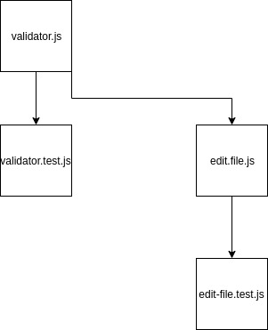

# LAB - 03

## Async

### Author: Travis Skyles

### Links and Resources
* [submission PR](https://github.com/tskyles-401-advanced-javascript/401-lab-03/pull/1)
* [travis](https://travis-ci.com/tskyles-401-advanced-javascript/401-lab-03)

#### Documentation
- `jsdocs` live-server from `/docs` directory

### Modules
  validator.js
  edit-file.js

#### How to initialize/run
- clone repository
- npm start
  
#### Tests
eslint - npm run lint
tests - npm test

#### UML
